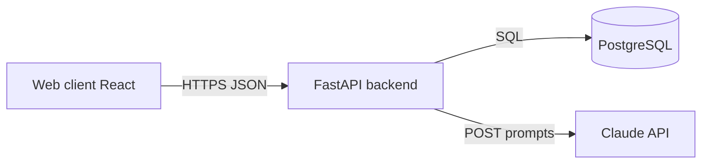

# Relay — Product & Architecture Overview

This document describes **what** we are building, **how** the system is shaped, and **where** the roadmap is headed. It is written in the same spirit as internal product and engineering docs you would see in a professional environment.

---

## How this relates to “professional” product documentation

Teams rarely rely on a single file. They stack **layers of truth**, each for a different audience and lifecycle:

| Layer | Typical artifacts | Who uses it | What it answers |
|--------|-------------------|-------------|-----------------|
| **Product** | Vision, PRD, roadmap | PM, leadership, partners | *Why* are we building this, *for whom*, *by when*? |
| **Solution / design** | Tech specs, RFCs, [ADRs](https://adr.github.io/) (Architecture Decision Records) | Engineers, architects | *How* will we build it, and what did we *reject*? |
| **System shape** | Architecture overviews, context diagrams, data model | New hires, security, platform | *What* are the main pieces and boundaries? |
| **Contracts** | OpenAPI/Swagger, event schemas, DB migrations | Frontends, integrators, QA | *Exactly* what can I call, and *what* does it return? |
| **Delivery** | Issue trackers (Linear, Jira), sprints, release notes | The whole team | *What* shipped in *which* version? |
| **Operations** | Runbooks, env var lists, on-call playbooks | SRE, on-call | *What* do I do when things break? |

**This file** is a **compressed architecture + feature outline**: it is closer to a **solution / architecture** doc plus a **light PRD** than to API reference (use `/docs` on the FastAPI app for that) or to an ADR (which would be one short file per *decision*, e.g. “AI as translation layer only”).

For a small team or a portfolio project, one well-maintained **overview doc + OpenAPI + README** is a common and professional baseline.

---

## 1. Product vision

**One-line description:** A Linear-inspired issue tracker where work is organized as **issues** (optionally under **projects**), with **optional authentication**, **assignments**, and **natural-language queries** over the issue set.

**Primary goals:**

- **Portfolio quality:** Full-stack, coherent UX, and a memorable surface (e.g. Kanban + AI query) suitable for demos and case studies.
- **Core loop:** Create, triage, assign, and find issues; optionally scope work to **projects** and **members** with **roles**.

**In scope (roadmap):**

- Issues (workspace-level or project-scoped), with reporter/assignee, including anonymous create where designed.
- Projects, membership, and role-aware edit/delete rules.
- AI layer that **only translates** natural language into **existing** filters; core query logic remains authoritative.
- Optional stretch: **comments**; **deploy** (Railway + Vercel).

**Out of scope (for this roadmap):**

- Full parity with Linear, notifications at scale, real-time multi-user cursors, billing, org-wide SSO, etc. (unless you explicitly extend the roadmap later).

---

## 2. System context (who talks to what)



- **Client:** React 19, Vite, TanStack Router & Query, Tailwind v4, shadcn/ui.
- **Backend:** FastAPI, Pydantic/SQLModel, Alembic, JWT auth.
- **Data:** PostgreSQL.
- **AI (planned):** Anthropic API — structured extraction only; **no** requirement to trust model output for authorization.

---

## 3. High-level building blocks (logical architecture)

| Area | Responsibility |
|------|----------------|
| **Web UI** | Routes, layout, forms, list/board views, token storage, API client, optimistic UX where used. |
| **API** | HTTP surface, validation, auth dependencies (`get_current_user`, `get_optional_user` when added), error mapping, pagination. |
| **Domain / persistence** | SQLModel models, relationships, Alembic migrations, query composition. |
| **AuthN** | Register, login, JWT issue/verify, optional vs required dependencies. |
| **AuthZ (planned in depth)** | Project membership and roles: who may edit or delete an issue, especially inside a project. |
| **AI (planned)** | `POST` natural language → Pydantic-validated filter DTO → reuse existing list/query code path. |

---

## 4. Data model (target shape)

The following reflects the **intended** domain per the project roadmap. Implementation may still be in progress; migrations and code should be reconciled with this as the **source of intent**.

```
User
 ├─< ProjectMember >─ Project
 └─< Issue (as reporter or assignee)

Issue
 ├── project_id   → Project | NULL   (NULL = workspace / inbox, not in a project)
 ├── reporter_id  → User  | NULL   (NULL = anonymous reporting)
 └── assignee_id  → User  | NULL   (optional, set on create or later)
```

**Rules (intended product behavior):**

- Issue **creation** may be available with **optional** auth: valid token → set `reporter_id`; no token → anonymous.
- `assignee_id` is optional in payloads and can change over time.
- `project_id` null → issue appears in workspace **inbox**-style views.
- **Project** CRUD and **member** management are **authenticated**.
- **Edit/delete** of an issue should eventually enforce: reporter, assignee, or project **member** with a sufficient **role** (per roadmap).

*Project* table (already planned/implemented in spirit): e.g. `id`, `name`, `description`, `owner_id` → User, `created_at`.

*Project members (planned):* join entity with `project_id`, `user_id`, `role` (e.g. `owner` | `member` | `viewer`).

---

## 5. Feature catalog (by area)

### 5.1 Authentication & users

- Register and login; JWT for subsequent requests; `get_current_user` for protected operations.
- **Planned:** `get_optional_user` (no 401 if token missing/invalid in anonymous-friendly flows, per product rules).

### 5.2 Issues

- **Today (roadmap status):** CRUD, filter by status/priority, pagination; work in progress to align the **Issue** model with `project_id`, `reporter_id`, `assignee_id` and to persist `reporter_id` on create.
- **Planned (FE):** Inbox vs project views, filters, issue detail, Kanban (e.g. `@dnd-kit/core`), status updates on drag.

### 5.3 Projects

- **Planned / partial:** Project CRUD; list issues for a project; `GET` workspace issues (no or null `project_id`); project members and roles; invite/remove flows.

### 5.4 AI query (week 3)

- **Input:** e.g. `POST /api/v1/ai/query` with `{ "prompt": "…" }`.
- **Output:** issues from **existing** query path + optional **transparency** to user (e.g. “interpreted as: open · this week · assigned to me”).
- **Principle:** AI is a **translator**, not a source of truth for permissions or data shape.

### 5.5 Optional stretch

- **Comments** on issues (with nullable `user_id` for anonymous).
- **Deploy:** e.g. Railway (API + DB), Vercel (static/SSR front), env: `DATABASE_URL`, `SECRET_KEY`, `ANTHROPIC_API_KEY`, CORS.

---

## 6. Cross-cutting concerns

- **CORS, env config:** Pydantic settings; CORS for known front-end origins in production.
- **Errors:** Global exception handlers; consistent JSON error bodies for the client.
- **Testing:** Pytest for critical routes (auth, issues) — expand as new surfaces ship.
- **Migrations:** Alembic; nullable FKs and multiple FKs to the same table require care (see **Common pitfalls** in [ROADMAP.md](../ROADMAP.md)).

---

## 7. Phased delivery (from roadmap, simplified)

1. Stabilize **issue** model and auth behavior (reporter, optional user, `assignee_id`, migrations).
2. **Projects** + **members/roles** on the backend; then **frontend** auth, projects, and **issue** UX.
3. **Kanban** and polish (loading, empty states, toasts, responsive).
4. **AI query** backend and UI, then **deploy** and **portfolio** writeup; **comments** if time allows.

See [ROADMAP.md](../ROADMAP.md) for the day-by-day breakdown and **priority order** if time is limited.

---

## 8. Maintenance

- **When the product or stack changes meaningfully** (new service, new auth model, new env vars): update *this* overview *or* add a short **ADR** for a single decision and link it here.
- **When an endpoint ships or changes contract:** keep **OpenAPI** (`/docs`) the source of truth; mention breaking changes in PR descriptions or a **CHANGELOG** if the project grows.

This document should stay **one level above** line-by-line code: enough for onboarding and alignment, not a substitute for the codebase or Swagger.
